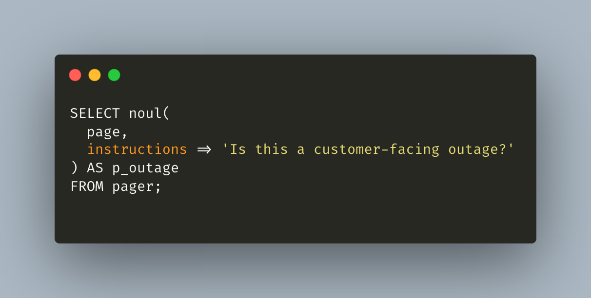
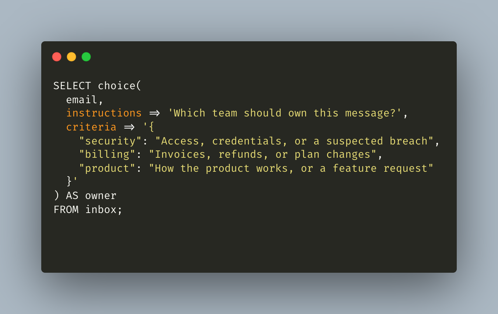
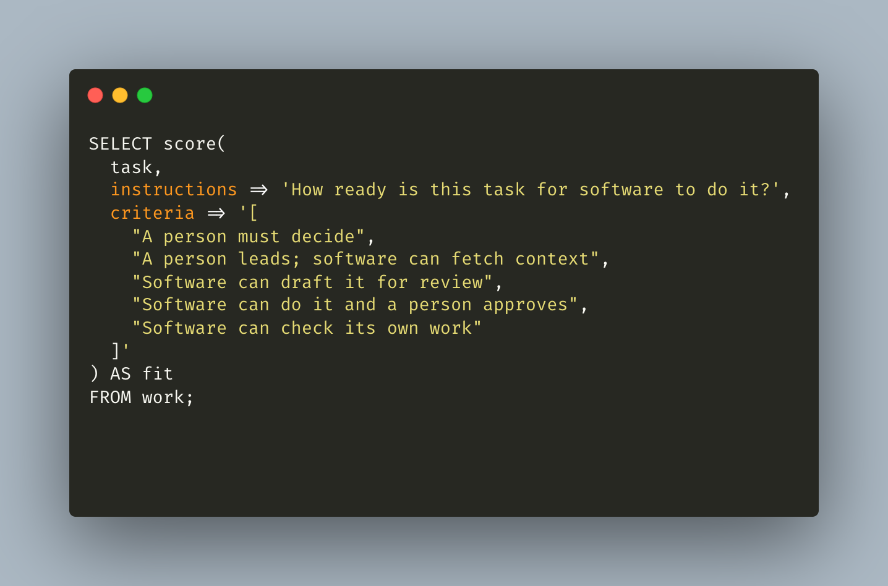
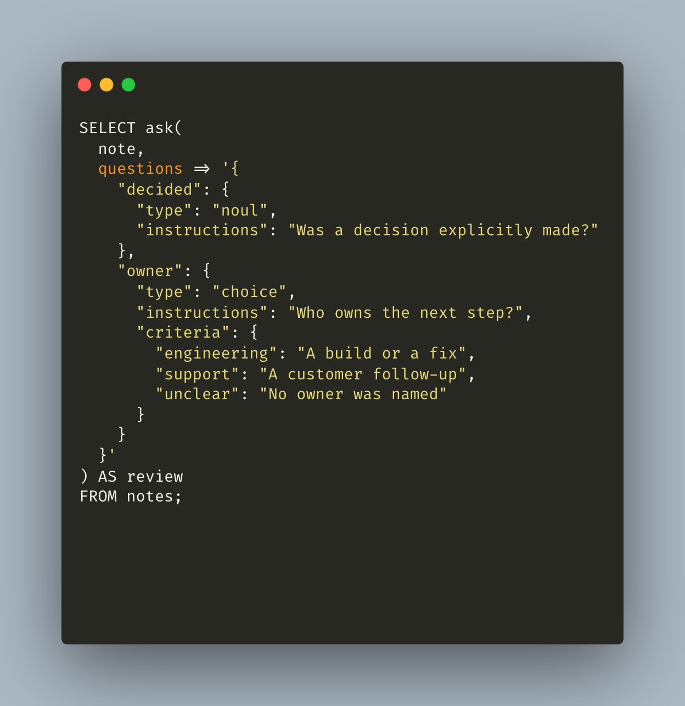
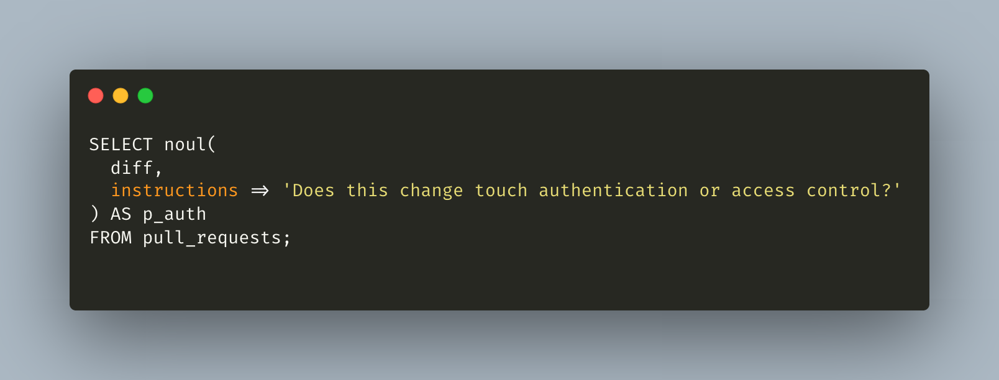
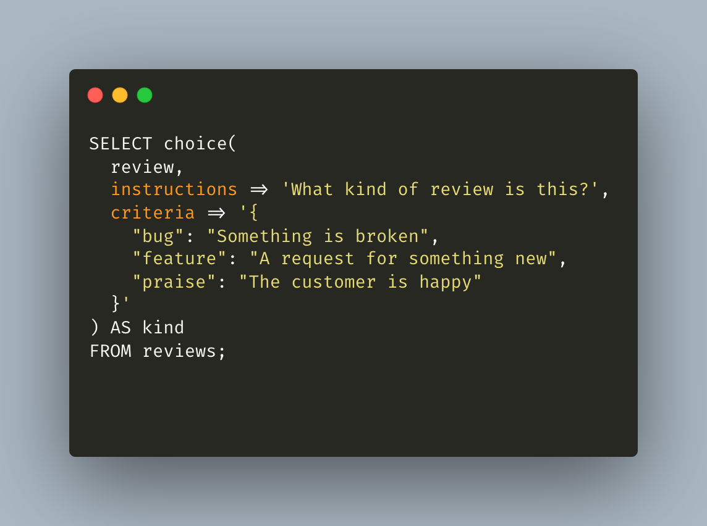
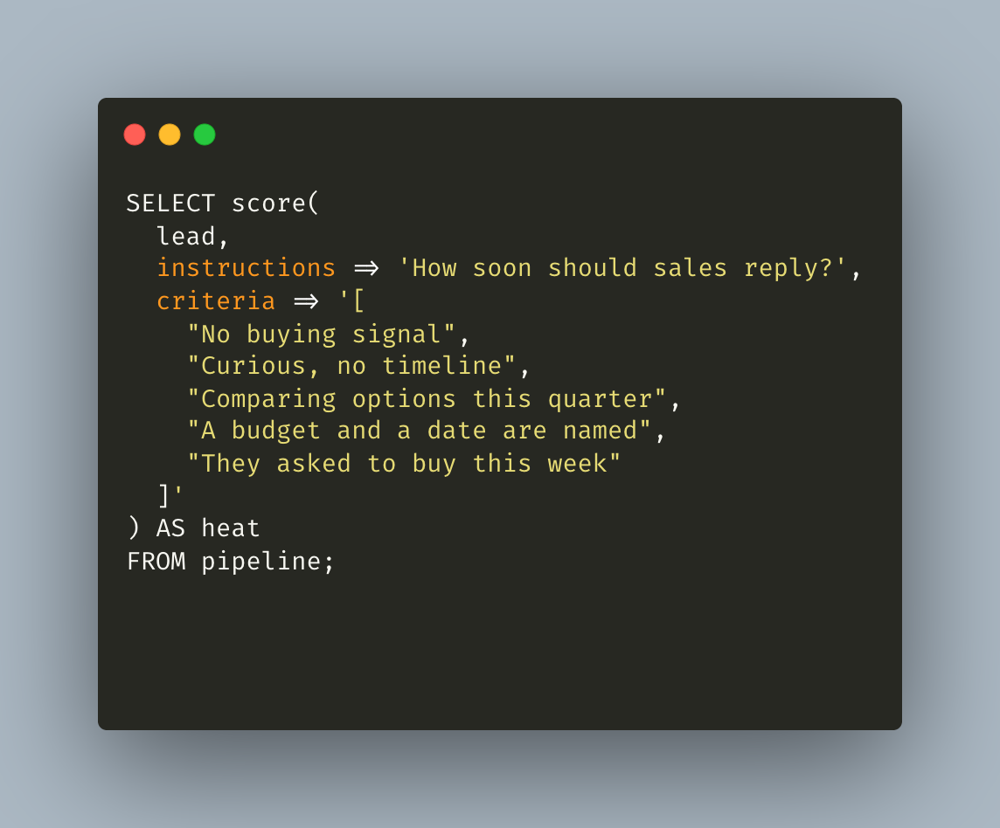
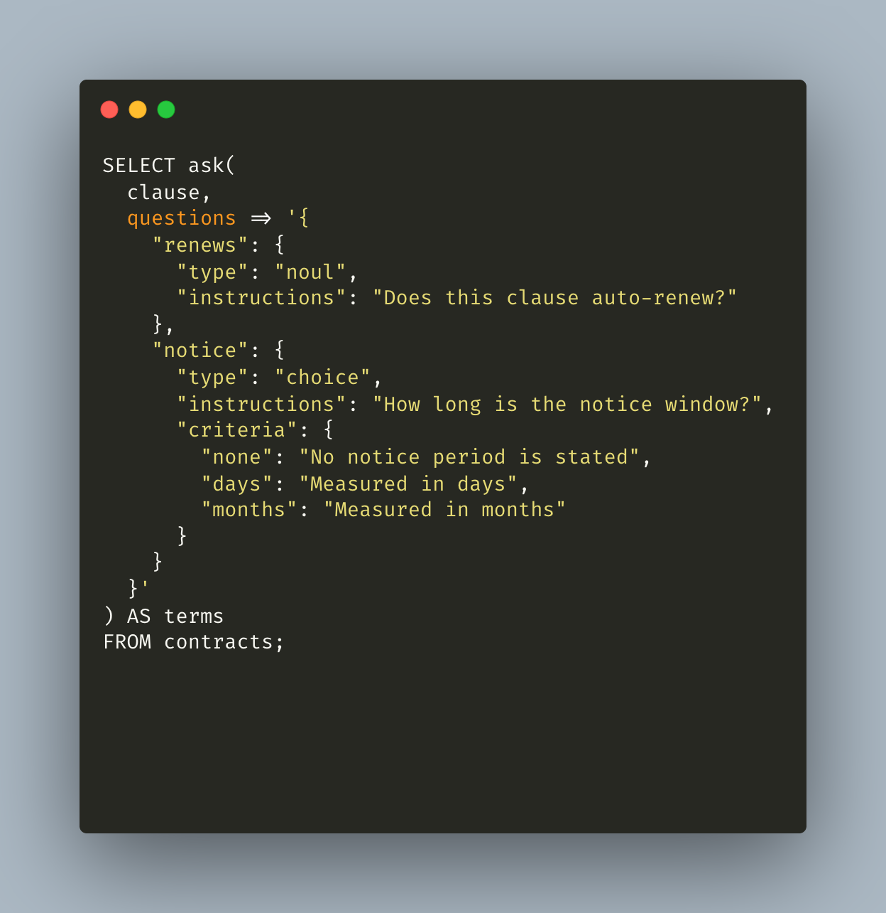

# Examples

Queries beyond the refund walkthrough in the [README](README.md). The screenshots are the SQL. The tables under them are simulated answers for the row described in each section. They are not a live model call.

## Is this a customer-facing outage?

`page` is `Checkout returns 500 for every customer in eu-west.`

| p_outage |
| --- |
| 0.96 |

A later `WHERE p_outage > 0.8` keeps the pages worth waking someone for.

## Which team owns this email?

`email` is `Our SSO certificate expires Friday and login is already failing for new sessions.`

| label | confidence | probabilities |
| --- | --- | --- |
| security | 0.94 | security 0.94, billing 0.01, product 0.05 |

## How ready is this task for software?

`task` is `Every Friday I copy milestones from six boards into the same status update. The account lead approves it before it goes out.`

The rubric runs from 0, a person must decide, to 4, software can check its own work.

| fit | confidence | probabilities |
| --- | --- | --- |
| 3.10 | 0.81 | 0: 0.02, 1: 0.06, 2: 0.18, 3: 0.48, 4: 0.26 |

3.10 sits on "software can do it and a person approves," which matches a recurring draft that still needs a sign-off.

## What did the meeting actually decide?

`note` is `We agreed engineering will ship the checkout fix tomorrow. Support will email the affected accounts after it is live.`

| decided | owner | owner confidence |
| --- | --- | --- |
| 0.93 | engineering | 0.88 |

`ask` returns the response text. The table is that text read back into columns. `owner` is engineering rather than support because the question asked who owns the next step, and the note names the fix first.

## Does this pull request touch auth?

`diff` is `Adds a session cookie check before the billing admin routes, and rejects missing scopes.`

| p_auth |
| --- |
| 0.97 |

## What kind of review is this?

`review` is `Love the new export. Can you also add a CSV button? The PDF one crashed twice this week.`

| label | confidence | probabilities |
| --- | --- | --- |
| feature | 0.61 | bug 0.27, feature 0.61, praise 0.12 |

The praise and the crash are both in the text, so the winning label is not a blowout. That is what the distribution is for.

## How soon should sales reply?

`lead` is `We have budget approved for Q4 and want a pilot with two teams starting October 6.`

The scale runs from 0, no buying signal, to 4, they asked to buy this week.

| heat | confidence | probabilities |
| --- | --- | --- |
| 3.20 | 0.77 | 0: 0.01, 1: 0.04, 2: 0.14, 3: 0.56, 4: 0.25 |

## Does this clause auto-renew?

`clause` is `This agreement renews for successive one-year terms unless either party gives written notice at least 30 days before the end of the then-current term.`

| renews | notice | notice confidence |
| --- | --- | --- |
| 0.98 | days | 0.91 |
