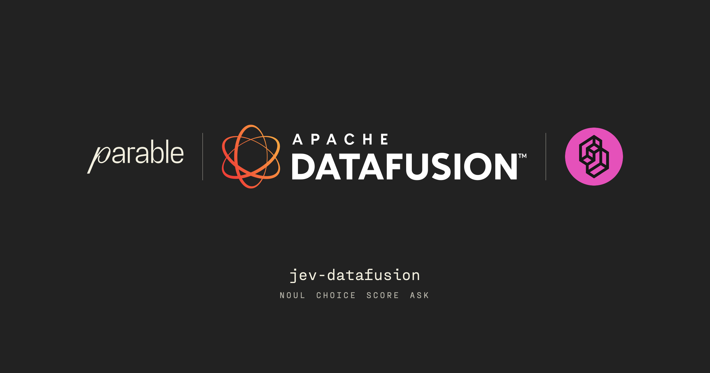
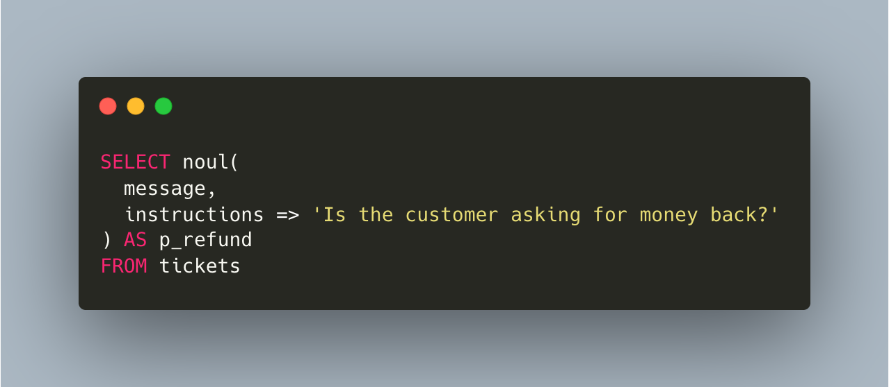
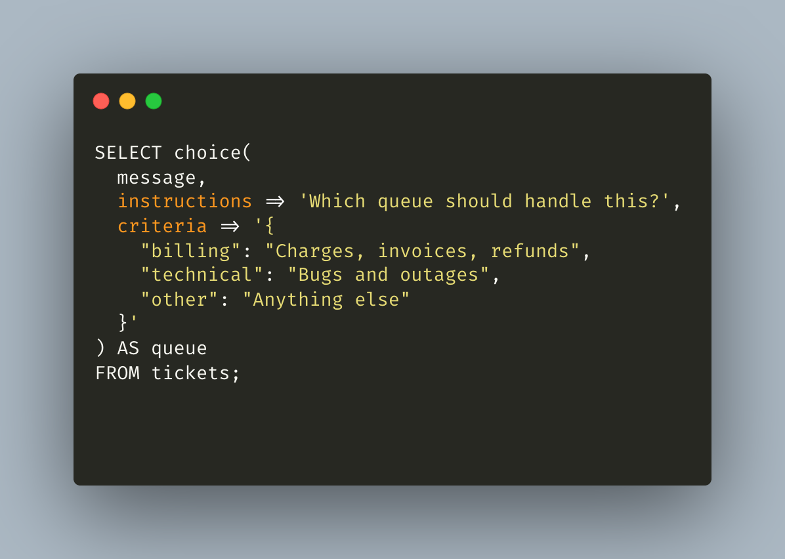
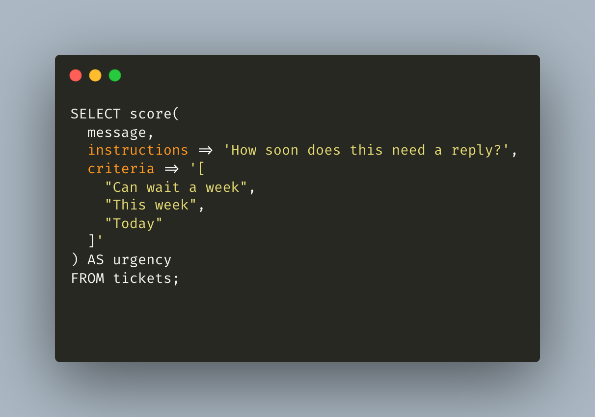
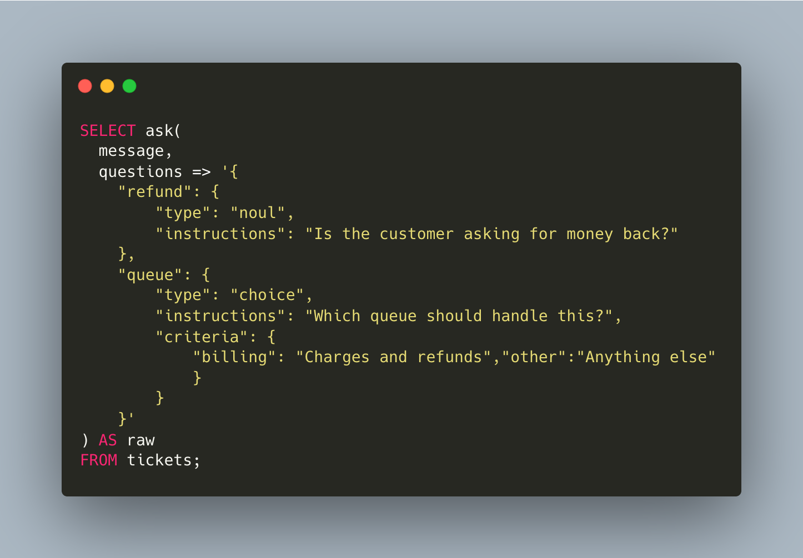

# jev-datafusion

[TypeSafe](https://typesafe.ai/) built Jev to hand software a decision instead of a paragraph: how likely something is, which option it is, or where it sits on a scale you wrote. jev-datafusion runs those decisions inside DataFusion, so you can do it at petabyte scale. That unlocks work that never fit in a single prompt. Score every open ticket. Route a year of email. Ask five questions of every meeting note and join the answers to the rest of the warehouse. A few of those queries are in [Examples](EXAMPLES.md).

This crate does not contain DataFusion. You depend on DataFusion from crates.io and register the functions on a `SessionContext`. TypeSafe is one server. OpenRouter is another. Any endpoint that speaks the same JSON can be a third.

## noul

Yes or no. One float from 0 to 1. A value near 0.5 means the call is ambiguous.



| p_refund |
| --- |
| 0.99 |

## choice

Pick one label and keep the full distribution. The result is a struct: `label`, `confidence`, `probabilities`.



| label | confidence | probabilities |
| --- | --- | --- |
| billing | 0.97 | billing 0.97, technical 0.02, other 0.01 |

## score

Place the row on an ordered rubric. The score is the expected position on that list. The result is a struct: `score`, `confidence`, `probabilities`.



| score | confidence | probabilities |
| --- | --- | --- |
| 1.86 | 0.84 | 0: 0.04, 1: 0.18, 2: 0.78 |

## ask

Several questions about the same row, in one request. The result is the server's response text, unchanged.



| refund | queue | queue confidence |
| --- | --- | --- |
| 0.99 | billing | 0.96 |

The tables are simulated answers for one row whose `message` is `I was charged twice for my annual plan this morning. Please refund one of the charges today.` They are not a live model call.

Leave `model` off to use the server default. Pass `model => 'jev-1.13.0'` or `model => 'typesafe/jev-1.13'` when the call should be pinned. `SET jev.on_error = 'null'` turns a bad row into NULL. `fail` stops the query. A missing API key still fails while planning.

## Quick start

This crate was written and tested against DataFusion 53.1.0.

```toml
[dependencies]
jev-datafusion = { git = "https://github.com/parable-work/jev-datafusion", tag = "v1.0.0" }
datafusion = "=53.1.0"
```

```rust
use std::sync::Arc;

use datafusion::prelude::SessionContext;
use jev_datafusion::{register, sql, TypeSafe};

let ctx = SessionContext::new();
register(&ctx, Arc::new(TypeSafe::from_env()?))?;

let batches = sql(
    &ctx,
    "SELECT noul(message, instructions => 'Is the customer asking for money back?') FROM tickets",
)
.await?
.collect()
.await?;
```

Run queries through `jev_datafusion::sql`. That wrapper fills omitted optional arguments. `SessionContext::sql` will reject a call that skips `criteria` or `model`.

Register one server. A second `register` fails because the names are already taken.

```rust
// OpenRouter. Reads OPENROUTER_API_KEY. Default model: typesafe/jev-1.13
// POST https://openrouter.ai/api/alpha/decisions
register(&ctx, Arc::new(jev_datafusion::OpenRouter::from_env()?))?;
```

```rust
// Any other System One URL, including a model that is not Jev.
register(
    &ctx,
    Arc::new(jev_datafusion::Compatible::new(
        Some(api_key),
        "https://example.test/v1/systemone",
        "your-model-id",
    )?),
)?;
```

`jev-1.13.0` is only the TypeSafe default. TypeSafe reads `TYPESAFE_API_KEY` and posts to `https://api.typesafe.ai/v1/systemone`.

## Try it

```bash
TYPESAFE_API_KEY=... cargo run --example live
OPENROUTER_API_KEY=... cargo run --example live
```

OpenRouter is used when both variables are set. The example prints the server name and the four result tables. It does not print the key.

GitHub Actions runs the same kind of check once per server: one `noul`, and the answer must be a probability from 0 to 1. Those keys are repository secrets, not files in git. The rest of `cargo test` uses DataFusion against a local HTTP server, so the planner and the HTTP client are real without calling a hosted model.

```bash
cargo test
```

## Behavior worth knowing

- At most eight HTTP requests are in flight per process. 429 is retried. TypeSafe and compatible endpoints also retry 529. Four attempts, 60 second deadline.
- Identical requests in one batch are sent once. Distinct rows are separate requests. `ask` is how several questions share one request.
- A missing key fails at planning time. The error names `TYPESAFE_API_KEY`, `OPENROUTER_API_KEY`, or `JEV_API_KEY`.
- TypeSafe prices `jev-1.13.0` at $0.042 per million input tokens. OpenRouter and compatible servers use `usage.cost` when the response includes it.
- State can be text, JSON, an Arrow struct or map, or a Parquet Variant.

## Releases

This project uses [semantic versioning](https://semver.org/). `1.0.0` is the first stable release. Install that tag, shown above, when you want a fixed version.

Later releases are cut from `main` by [release-plz](https://release-plz.dev/). Write commits in the [conventional](https://www.conventionalcommits.org/) form:

- `fix:` is a patch, `1.0.1`
- `feat:` is a minor, `1.1.0`
- `feat!:` or a `BREAKING CHANGE:` footer is a major, `2.0.0`

release-plz opens a pull request with the version bump and changelog. Merging it creates the git tag and the GitHub release. The crate is not published to crates.io.

## License

Apache-2.0. See [LICENSE](LICENSE).

## For an agent

```text
Add jev-datafusion to this Rust project. Do not vendor or fork DataFusion.

The crate was written and tested against DataFusion 53.1.0 and Arrow 58.3.0. If this project is already on that version, add:

[dependencies]
jev-datafusion = { git = "https://github.com/parable-work/jev-datafusion", tag = "v1.0.0" }
datafusion = "=53.1.0"

If this project uses a newer DataFusion, do not downgrade the whole project to 53.1.0. Integrate the four functions into the version already in Cargo.toml. Keep the SQL surface the same: noul, choice, score, and ask. Update the registration and the call that fills optional arguments where SessionContext, async UDFs, or named-argument SQL have changed. Change this crate's DataFusion dependency only as far as that version requires, and fix the compile errors that follow. The goal is a working register() and jev_datafusion::sql() on the project's DataFusion, not a pin back to 53.1.0.

Register exactly one server before any judgment query:

use std::sync::Arc;
use datafusion::prelude::SessionContext;
use jev_datafusion::{register, sql, OpenRouter, TypeSafe};

let ctx = SessionContext::new();

// TypeSafe. Reads TYPESAFE_API_KEY. Default model: jev-1.13.0
// POST https://api.typesafe.ai/v1/systemone
register(&ctx, Arc::new(TypeSafe::from_env()?))?;

// OpenRouter instead. Reads OPENROUTER_API_KEY. Default model: typesafe/jev-1.13
// POST https://openrouter.ai/api/alpha/decisions
// register(&ctx, Arc::new(OpenRouter::from_env()?))?;

// Or any other System One URL and model id:
// register(&ctx, Arc::new(jev_datafusion::Compatible::new(Some(api_key), "https://example.test/v1/systemone", "your-model-id")?))?;

Run SQL through jev_datafusion::sql, not SessionContext::sql, so omitted optional arguments are filled.

SELECT noul(message, instructions => 'Is the customer asking for money back?') AS p_refund FROM tickets;

SELECT choice(message, instructions => 'Which queue should handle this?', criteria => '{"billing":"Charges, invoices, refunds","technical":"Bugs and outages","other":"Anything else"}') AS queue FROM tickets;

SELECT score(message, instructions => 'How soon does this need a reply?', criteria => '["Can wait a week","This week","Today"]') AS urgency FROM tickets;

SELECT ask(
  message,
  questions => '{
    "refund": {
      "type": "noul",
      "instructions": "Is the customer asking for money back?"
    },
    "queue": {
      "type": "choice",
      "instructions": "Which queue should handle this?",
      "criteria": {
        "billing": "Charges and refunds",
        "other": "Anything else"
      }
    }
  }'
) AS raw
FROM tickets;

noul returns a float. choice returns label, confidence, and probabilities. score returns score, confidence, and probabilities. ask returns the response text unchanged. An explicit model => '...' argument overrides the server default. SET jev.on_error = 'null' turns a bad row into NULL instead of failing the query. Keep API keys in the environment. Do not commit them.
```
